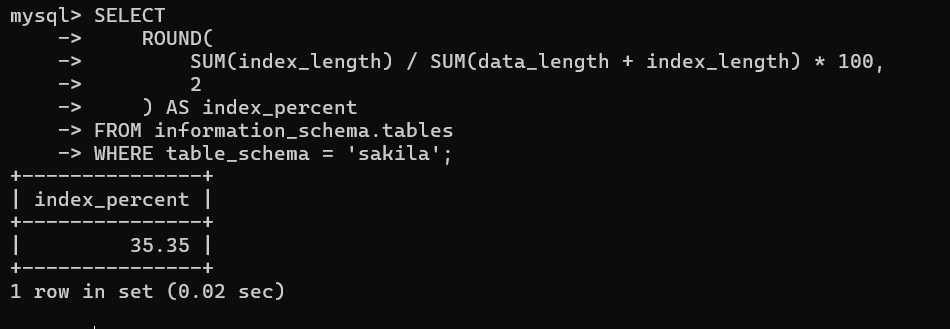
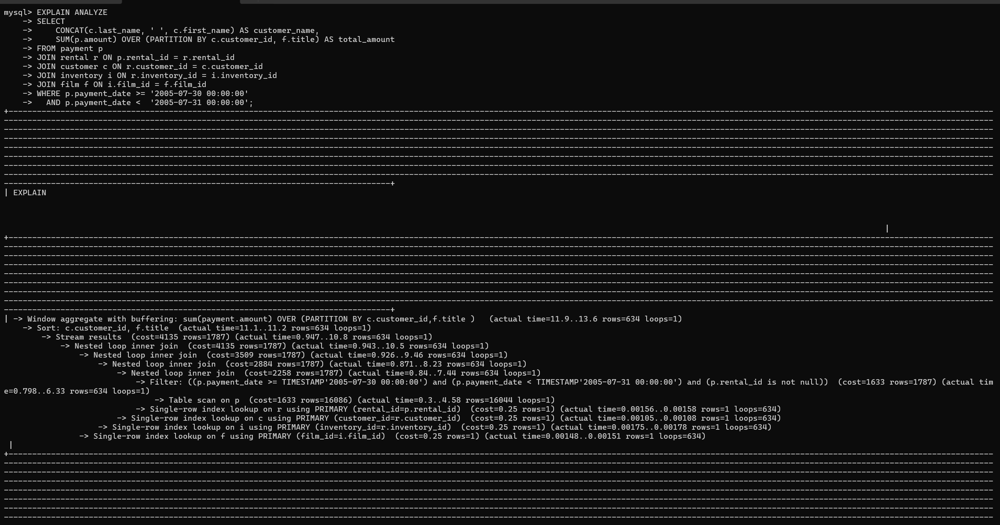
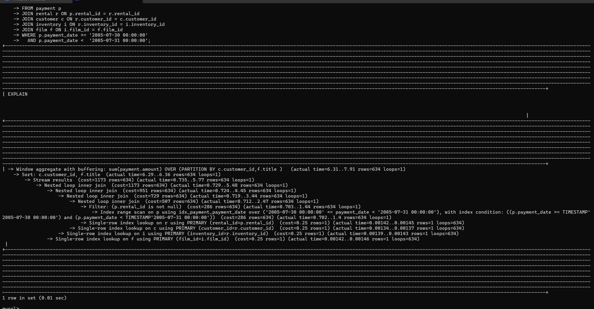

## Задание 1
Запрос
```sql
SELECT
    ROUND(
        SUM(index_length) / SUM(data_length + index_length) * 100,
        2
    ) AS index_percent
FROM information_schema.tables
WHERE table_schema = 'sakila';
```
Результат

Размер индексов составляет 35.35% от общего размера данных базы данных Sakila.



## Задание 2
Исходный запрос :
```sql
 SELECT
    CONCAT(c.last_name, ' ', c.first_name) AS customer_name,
    SUM(p.amount) OVER (PARTITION BY c.customer_id, f.title) AS total_amount
FROM payment p
JOIN rental r ON p.rental_id = r.rental_id
JOIN customer c ON r.customer_id = c.customer_id
JOIN inventory i ON r.inventory_id = i.inventory_id
JOIN film f ON i.film_id = f.film_id
WHERE p.payment_date >= '2005-07-30 00:00:00'
  AND p.payment_date < '2005-07-31 00:00:00';
  ```
  
Анализ выполнения

Для анализа был использован оператор:

EXPLAIN ANALYZE
Выявленные узкие места
Выполнялся полный просмотр таблицы payment (Table Scan).
Для обработки оконной функции выполнялась сортировка данных.
В исходном варианте запроса использовалась функция DATE(payment_date), которая препятствует эффективному использованию индекса.
Использовался устаревший синтаксис соединения таблиц.
Скриншот плана выполнения до оптимизации


Оптимизация

Для ускорения выполнения запроса был создан индекс:

```
CREATE INDEX idx_payment_payment_date
ON payment(payment_date);
```
После создания индекса запрос был выполнен повторно с использованием:
```
EXPLAIN ANALYZE
```
Результат оптимизации

После создания индекса сервер начал использовать:
```

Index Range Scan on p using idx_payment_payment_date
```

вместо полного просмотра таблицы:

Table Scan on p

Также снизилась стоимость выполнения запроса и ускорилась фильтрация записей по дате.

Скриншот плана выполнения после оптимизации


Вывод

Создание индекса по полю payment_date позволило заменить полный просмотр таблицы на использование индекса. Это уменьшило объём обрабатываемых данных и повысило производительность запроса.
